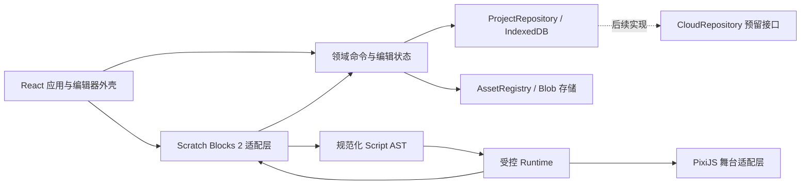

# 儿童无代码编程游戏平台：项目架构设计方案 V1.0

> 状态：待确认；本阶段只做架构设计，不创建工程、不安装依赖、不编写业务代码。  
> 依据：《儿童无代码编程游戏平台产品设计说明书 V1.2》与 `参考图.png`。  
> 设计范围：先交付 local-first Web/PWA MVP，云端、公开分享、课程和 AI 仅保留边界。

## 1. 架构目标

1. 先形成“选角色 → 拼积木 → 运行 → 自动保存 → 刷新恢复”的完整闭环。
2. 编辑器、积木内核、运行时和舞台渲染彼此隔离，可单独测试和替换。
3. 积木只生成受控 AST，由解释器执行；禁止 `eval`、`new Function` 和任意脚本注入。
4. 编辑态与运行态严格分离；停止运行后恢复运行前快照，不污染项目初始数据。
5. 以稳定 ID 引用素材、角色、场景和广播消息，显示名称及文件路径不得成为业务标识。
6. 鼠标与触控共用指针交互模型，保证 768px 以上横屏设备可完成核心创作。

## 2. 总体架构



依赖规则：

- `domain` 不依赖 React、Scratch Blocks、PixiJS、Dexie 或 DOM。
- `runtime` 只依赖领域类型和注入端口，不访问 DOM、网络或 IndexedDB。
- `block-adapter` 负责积木 UI、序列化与 AST 转换，不直接控制舞台。
- `stage` 负责显示和指针命中，不直接修改项目，也不解释积木。
- `web` 是组合根，负责把状态、适配器、运行时、舞台和持久化组装起来。

## 3. 技术选型

| 领域     | 选择                                            | 架构约束                                                  |
| -------- | ----------------------------------------------- | --------------------------------------------------------- |
| 工程     | pnpm workspace + TypeScript strict + Vite       | 锁定 Node LTS、pnpm 和所有直接依赖版本                    |
| 应用     | React + React Router                            | 页面层只编排功能，不承载领域规则                          |
| 编辑状态 | Zustand + Immer                                 | 只保存编辑态和 UI 状态；逐帧运行状态不进入 React Store    |
| 积木     | `scratch-blocks` 2.1.x；使用其依赖的 Blockly 12 | 不并装第二套 Blockly 内核；统一由适配层访问               |
| 舞台     | PixiJS 8                                        | 异步初始化；首选 WebGL，后续评估 WebGPU；React 不逐帧驱动 |
| 持久化   | Dexie + IndexedDB                               | Repository 接口隔离；项目 JSON 与 Blob 分库存储、事务提交 |
| Schema   | Zod                                             | 导入、读取、迁移和运行前均校验                            |
| 样式     | CSS Modules + CSS 设计令牌                      | 适合参考图中的定制积木感 UI，避免组件内散落颜色与尺寸     |
| 测试     | Vitest + Testing Library + Playwright           | 领域、运行时、适配器、E2E 与视觉回归分层                  |
| PWA      | Vite PWA 插件                                   | M5 再开启离线应用壳，避免影响早期调试                     |

选型说明：Scratch Blocks 2 已改为依赖 Blockly 12，不再是独立 Blockly 分叉。因此 MVP 采用一个积木内核，并通过 `BlockWorkspaceAdapter` 隔离版本变化。Blockly 工作区使用官方推荐的 JSON 序列化，不以 XML 作为主格式。

## 4. 仓库结构

```text
kid-code-studio/
├── apps/
│   └── web/                         # Vite + React 应用、路由、组合根、PWA
│       └── src/
│           ├── app/                 # providers、router、error boundary
│           ├── pages/               # home、editor、playtest、help
│           ├── features/            # projects、editor、assets、tutorial
│           └── styles/              # 全局 reset 与设计令牌
├── packages/
│   ├── domain/                      # Project Schema、迁移、命令、端口
│   ├── runtime/                     # EventBus、Scheduler、Interpreter、碰撞
│   ├── block-adapter/               # Scratch Blocks 封装、积木定义、AST 编译
│   ├── stage/                       # PixiJS、场景图、命中、气泡、舞台缩放
│   ├── persistence/                 # Dexie Repository、导入导出、恢复草稿
│   ├── assets/                      # manifest 类型、注册表、解码和资源检查
│   ├── ui/                          # 无业务状态的通用儿童 UI 组件
│   └── testing/                     # factories、fake clock、fixtures、test helpers
├── fixtures/                        # 最小项目、损坏项目、性能项目、模板数据
├── public/assets/                   # 经规范化的内置素材发布目录
├── e2e/                             # Playwright 测试
├── docs/
│   ├── adr/                         # 架构决策记录
│   ├── protocols/                   # AST、项目包、事件协议
│   └── product-spec.md              # 开发可检索版需求基线
├── scripts/                         # 素材校验、NOTICE、Schema/fixture 检查
├── pnpm-workspace.yaml
└── package.json
```

不在 M0 建立空的后端应用。云端只通过 `CloudProjectRepository`、`AuthPort` 和 `SharePort` 接口预留；进入 V1 云端阶段时再增加 `apps/api`，避免 MVP 被未使用的服务拖慢。

## 5. 核心模块边界

### 5.1 `packages/domain`

- 定义 `ProjectV1`、`Scene`、`SpriteDefinition`、`SpriteInstance`、`Script`、`AssetManifestItem`。
- 保存 Zod Schema、稳定 ID 规则、默认值和逐级 migration registry。
- 实现 `EditorCommand`、撤销/重做栈及 500ms 连续拖动合并。
- 定义端口：`ProjectRepository`、`AssetRepository`、`ClockPort`、`AudioPort`、`TelemetryPort`。
- 不包含框架状态、浏览器对象和渲染对象。

### 5.2 `packages/block-adapter`

- 唯一允许直接 import Scratch Blocks/Blockly 的包。
- 定义工具箱、六类颜色主题、字段控件和 20–25 个业务积木。
- 把 Blockly 事件转换为领域命令，过滤 UI-only 事件和加载期间事件。
- 保存 Blockly JSON 工作区；编译为规范化 Runtime AST。
- 通过 `highlightBlock(blockId)` 接收调试反馈。

工作区 JSON 是“编辑恢复格式”，Runtime AST 是“执行协议”。两者在一次命令事务中生成，并记录同一 `sourceRevision`；AST 可重新生成，不作为独立人工编辑的数据源，从机制上避免双份脚本漂移。

### 5.3 `packages/runtime`

- `ProjectLoader`：校验快照、解析资源引用、构造 RuntimeModel。
- `EventBus`：绿旗、角色点击、碰撞、广播和场景事件。
- `Scheduler`：任务创建、帧预算、暂停/继续、取消令牌、并发上限。
- `Interpreter`：逐块返回 `continue / suspend / branch / stop / error`。
- `CollisionSystem`：MVP 使用空间过滤后的 AABB；金币可注册圆形碰撞器。
- `DebugBridge`：输出当前块、任务状态和儿童友好错误码。

时间、补间、音频和渲染全部通过接口注入。测试使用 `FakeClock` 确定性推进，不依赖真实 `requestAnimationFrame`。

### 5.4 `packages/stage`

- 维护 PixiJS Application、场景容器、角色显示对象、气泡层和调试层。
- 逻辑坐标固定 480×360，显示尺寸通过 `stageScale` 等比换算。
- 编辑态指针拖动只发出领域命令；运行态由 Runtime 事件更新显示对象。
- 资源通过 `AssetRegistry` 按稳定 ID 加载、缓存和释放。
- 组件卸载、场景切换和素材替换时成对释放纹理引用、监听器和 ticker。

### 5.5 `packages/persistence`

- IndexedDB stores：`projects`、`assets`、`drafts`、`settings`、`trash`。
- 保存采用单调递增 `revision` 和内容 hash，旧保存请求不得覆盖新修改。
- 编辑命令使项目进入 dirty；静默 2 秒后保存；失焦时立即 flush。
- 项目 JSON 与素材引用在事务中提交；大文件存 Blob，不嵌 Base64。
- `.kidgame` 导入先在隔离内存中检查路径、数量、总大小、MIME、hash 和 Schema，全部通过后再入库。

## 6. 两条关键数据链路

### 6.1 编辑与保存

```text
指针/键盘操作
  → UI 或 BlockWorkspaceAdapter
  → EditorCommand
  → ProjectModel + UndoStack
  → dirtyRevision 增加
  → 2 秒防抖
  → ProjectRepository 事务保存
  → 保存完成时核对 revision
  → 顶部显示“已保存”
```

如果保存期间又有修改，旧请求完成后仍保持 dirty，并继续保存最新 revision，避免错误显示“已保存”。

### 6.2 运行与停止

```text
点击绿旗
  → flush 当前积木编辑
  → ProjectModel 深只读快照
  → AST 编译 + Schema/引用校验
  → RuntimeModel
  → EventBus 发布 EVT_FLAG
  → Scheduler/Interpreter 按帧执行
  → StagePort 更新舞台 + DebugBridge 高亮积木

点击停止
  → cancelToken 全局取消
  → 清理任务/补间/计时器/气泡/音频
  → 丢弃 RuntimeModel
  → Stage 从编辑快照重建
```

停止是幂等操作，目标为 100ms 内完成取消并恢复。

## 7. 页面与组件架构

```text
AppShell
├── HomePage
│   ├── ProjectGrid
│   ├── TemplateGrid
│   └── ImportProjectDialog
├── EditorPage
│   └── EditorShell
│       ├── EditorTopBar
│       ├── BlockCategoryRail
│       ├── StagePanel
│       │   ├── PixiStageHost
│       │   └── StageOverlayControls
│       ├── ScriptWorkspacePanel
│       │   └── BlockWorkspaceHost
│       ├── SpriteTray
│       ├── SceneTray
│       └── AssetPickerDrawer
├── PlaytestPage
└── HelpPage
```

参考图落地为三层布局：

- 顶部：返回、作品名、保存状态、撤销/重做、运行/停止、设置。
- 主区：左侧积木分类，中间 4:3 舞台，右侧脚本工作区。
- 底部：角色横向列表与场景横向列表。

桌面宽屏使用 CSS Grid；平板横屏把积木工具箱改为抽屉，并让舞台位于上半屏、脚本区位于下半屏。小于 768px 显示横屏提示。触控目标不小于 44×44px，频繁操作建议 48×48px。

## 8. 状态划分

| 状态         | 所属                    | 示例                             | 禁止事项               |
| ------------ | ----------------------- | -------------------------------- | ---------------------- |
| 项目领域状态 | `domain` / editor store | scenes、sprites、scripts、assets | 不存 Pixi/Blockly 实例 |
| UI 状态      | web feature store       | 选中项、抽屉、缩放、弹窗         | 不进入项目导出包       |
| 工作区状态   | block-adapter           | Blockly JSON、选中块、视口       | 不直接作为运行时对象   |
| 运行状态     | runtime                 | tasks、stack、score、collision   | 不回写 ProjectModel    |
| 渲染状态     | stage                   | DisplayObject、texture、bubble   | 不作为业务真相         |
| 持久化状态   | persistence             | revision、hash、saveStatus       | 不驱动逐帧渲染         |

## 9. 项目与协议设计

- `schemaVersion` 首版为 `1.0`，所有读取必须经过 `migrate → validate → normalize`。
- ID 统一前缀：`prj_`、`scn_`、`spr_`、`ins_`、`scr_`、`blk_`、`ast_`、`msg_`。
- 删除采用显式引用检查；删除角色、场景和广播消息时由领域命令处理关联关系。
- 未知积木保留原始 JSON，在工作区显示“不支持”占位，不静默丢字段。
- 所有运行时错误只对外暴露定义过的错误码与儿童提示，技术堆栈仅进入开发日志。
- 导出包采用 ZIP：`project.json`、`thumbnail.png`、`assets/`；正式扩展名 `.kidgame`。

## 10. 素材架构与现有资源处理

现有素材包可作为开发输入，但当前实物与规范存在三处差异：

1. 角色目录实际为 `character/liji/`，需求规定为 `characters/liji/`。
2. 角色和音效文件包含中文文件名，需求规定发布路径只用小写 ASCII、数字和连字符。
3. `asset-manifest.json` 尚未登记栗奇、三个音效和强制的 provenance 字段。

实施时不覆盖原始素材包。增加一次性 intake/normalize 流程，把审核后的文件复制到 `public/assets/` 的规范路径，并生成发布 manifest：

```text
characters/liji/liji-idle.png
sounds/ui-click.ogg
sounds/collect-coin.ogg
sounds/game-success.ogg
```

业务代码永远只引用稳定 ID。角色多视角原图先作为美术源文件，不直接作为运行时纹理；确认默认视角和裁切后再生成 `costume_liji_idle`。

## 11. 测试与质量门禁

### 单元测试

- Schema、迁移、稳定 ID、领域命令、撤销/重做。
- Interpreter 每种执行结果、循环、并发、暂停、取消和上限保护。
- AABB/圆形碰撞、enter/stay/exit。
- 自动保存 revision 竞争与失败恢复。

### 集成测试

- Scratch Blocks JSON ↔ AST ↔ 工作区恢复。
- Runtime 事件 → StagePort/DebugBridge。
- IndexedDB 项目与 Blob 的事务保存、导入导出。
- Pixi 舞台缩放、命中和资源释放。

### E2E 与视觉回归

- 空白作品/模板 → 拖积木 → 运行 → 停止 → 保存 → 刷新恢复。
- iPad 横屏模拟：拖角色、拖积木、修改参数和运行。
- 损坏项目导入、保存失败恢复、无限循环保护。
- 参考图对应的桌面宽屏与 768px 横屏关键截图。

每个里程碑必须通过 `format`、`lint`、`typecheck`、`test`、`e2e`（适用时）和 `build`，不得以隐藏 P0 TODO 代替验收。

## 12. 分阶段实施计划

| 阶段          | 目标                 | 关键交付                                               | 通过门槛                        |
| ------------- | -------------------- | ------------------------------------------------------ | ------------------------------- |
| M0 基础工程   | 可持续开发底座       | workspace、严格 TS、Schema、CI、测试框架、ADR          | 全部静态检查与构建通过          |
| M1 编辑器骨架 | 可摆放角色、可拼积木 | 参考图布局、Pixi 舞台、角色栏、Scratch Blocks 适配     | 鼠标/触控基础操作通过           |
| M2 运行闭环   | 三块积木驱动栗奇     | `EVT_FLAG`、`MOT_MOVE`、`LOOK_SAY`、调度器、高亮、停止 | 首个垂直切片 E2E 通过           |
| M3 保存与素材 | 刷新不丢作品         | IndexedDB、自动保存、撤销、导入导出、素材注册          | AC-006/007/008 通过             |
| M4 完整 MVP   | P0 创作能力          | 20–25 积木、1–5 场景、声音、模板、引导、试玩           | 所有 P0 验收用例通过            |
| M5 发布准备   | 可稳定试用           | PWA、性能、视觉回归、第三方声明、诊断                  | 30 分钟稳定性与目标设备回归通过 |

代码编写获得确认后仍按 M0 → M1 → M2 顺序推进，不一次性铺开全部模块。

## 13. 已确定与待确认的决策

### 建议直接确认

1. 使用 `scratch-blocks` 2.1.x 作为唯一积木 UI 包，并锁定其 Blockly 12 依赖；不接入 Scratch VM。
2. 使用 CSS Modules + 设计令牌还原参考图，不使用 Tailwind。
3. MVP 只实现本地模式；不建后端，但保留 Repository/Port 接口。
4. 现有素材保留原件，通过规范化流程生成运行时副本和新 manifest。
5. 首个垂直切片只支持单角色、单场景及三块积木，验证架构后再扩展。

### 进入编码前补充确认

- “栗奇”默认运行视角：从现有 `单独视角.png` 中裁切，还是另行提供透明单角色 PNG。
- UI 还原目标：优先达到参考图的整体布局和儿童化质感，不要求首个里程碑像素级完全一致；M4 再做精细视觉回归。

## 14. 本阶段不做的事项

- 不创建 `kid-code-studio` 工程目录。
- 不安装 npm/pnpm 依赖。
- 不修改或重命名现有素材。
- 不实现后端、云同步、公开分享、AI 或课程系统。
- 不编写 React、Runtime、Blockly 或 PixiJS 业务代码。
